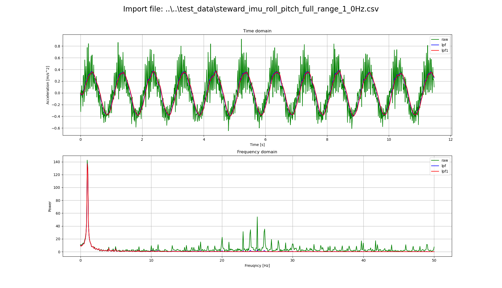

## Description

This repository contains simulations in Python using Matplotlib and C implementation tested on STM32 platfrom. All filters evaluated in simulations are realized in C for general embedded application use. 


## List of all filters
 - RC filter (LPF)
 - CR filter (HPF)
 - FIR


## Simulations

#### RC/CR filter simulations
Before using RC/CR filter in embedded system analysis can be done first to define order and cutoff frequency of specific acquired signal. This can be done via ***rc_filter.py*** script.

##### Script configurations
Before running the script some settings should be change. Those are:
 - Sample frequency of real platform
 - Ideal sample frequency
 - Time window for observation
 - Shape of test input signal
 - Amplitude/offset/phase of input signal
 - Cut-off frequency of LPF/HPF
 - Order of LPF/HPF

```python
## Sample frequency
#   Sample frequency of real system   
#
# Unit: Hz
SAMPLE_FREQ = 100.0

# Ideal sample frequency
#   As a reference to sample rate constrained embedded system
#
# Unit: Hz
IDEAL_SAMPLE_FREQ = 20000.0

## Time window
#
# Unit: second
TIME_WINDOW = 2.5

## Number of samples in time window
SAMPLE_NUM = int(( IDEAL_SAMPLE_FREQ * TIME_WINDOW ) + 1.0 )

## Select input filter signal type
INPUT_SINE = 0
INPUT_RECT = 1

## Input signal shape
INPUT_SIGNAL_AMPLITUDE = 1.0
INPUT_SIGNAL_OFFSET = 0.0
INPUT_SIGNAL_PHASE = 0.0

## Mux input signal
INPUT_SIGNAL_SELECTION = INPUT_SINE

## Input signal frequency
#
# Unit: Hz
INPUT_SIGNAL_FREQ = 5

## LPF fc
#
# Unit: Hz
LPF_FC_1 = 5.0
LPF_FC_2 = 5.0
LPF_FC_3 = 5.0

## LPF order
LPF_ORDER_1 = 1
LPF_ORDER_2 = 2
LPF_ORDER_3 = 3

## HPF fc
#
# Unit: Hz
HPF_FC_1 = 0.1
HPF_FC_2 = 0.1
HPF_FC_3 = 0.1

## HPF order
HPF_ORDER_1 = 1
HPF_ORDER_2 = 2
HPF_ORDER_3 = 3
```

##### Simple invokation of script via cmd:
```python
>>>py rc_filter.py
```

##### Example


#### FIR filter simulations
Similar to RC/CR filter simulation FIR filter has a list of configurations to be change according to simulation needs. It can be found at a top of a FIR filter simulator sript ***fir_filter.py***.

Calling sript is identical as shown at a previous example.

This script gives an example of ***firwin*** function usage to calculate FIR filter. Furthermore script has ability to simulate filters using externaly calculated FIR coefficient. For example from T-filter webpage ([link](http://t-filter.engineerjs.com/)).

##### Example


#### Reading signal from CSV file
For signals written in CSV file use ***filter_csv.py*** script with -f argument to select file to analyse. 

```python
# Example of invocation from console
>>>py filter_csv.py -f ..\..\test_data\steward_imu_roll_pitch_full_range_1_0Hz.csv
```

In simulations signal is being shown in time and frequency domain. By inspecting frequency signature of raw signal cutoff frequency of selected filter can be easily determine. 

##### Example of accelerometer data filtering
This example shows signal acquire from accelerometer and RC low pass filter in work. Upper picture shows raw and filtered signals in time domain and bottom shows same signals in frequency domain.




## C implementation
### RC filter
There are only two functions being a part of RC filter API:
 - *filter_status_t ***filter_rc_init***(p_filter_rc_t * p_filter_inst, const float32_t fc, const float32_t dt, const uint8_t order, const float32_t init_value)*
 - *float32_t ***filter_rc_update***(p_filter_rc_t p_filter_inst, const float32_t x)*

 ##### Example of usage

```C
// 1. Declare filter instance
p_filter_rc_t my_filter_inst;

/* 
*   2. Init RC filter with following parameters:
*   - fc = 10Hz
*   - order = 1
*   - inititial value = 0
*/ 
if ( eFILTER_OK != filter_rc_init( &my_filter_instance, 10.0f, SAMPLE_TIME, 1, 0 ))
{
    // Filter init failed
    // Further actions here...
}

// 3. Apply filter in period of SAMPLE_TIME
loop @SAMPLE_TIME
{
    // Update filter
    filtered_signal = filter_rc_update( my_filter_inst, raw_signal );
}

```

## TODO
 - [x] Evaluation of RC filter in python
 - [x] Evaluation of CR filter in python
 - [x] Implementation of RC filter in C   
 - [x] Implementation of CR filter in C   
 - [ ] Evaluation of FIR filter in python   
 - [ ] Implementation of FIR filter in C   
 - [ ] Evaluation of washout filter in python
 - [ ] Implementation of washout filter in C
 - [ ] Make filter_csv.py configurable via argparse

    
