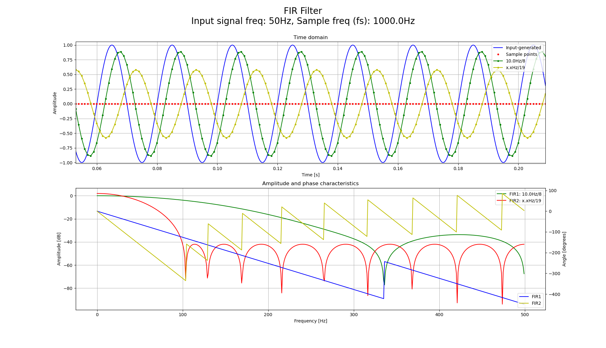
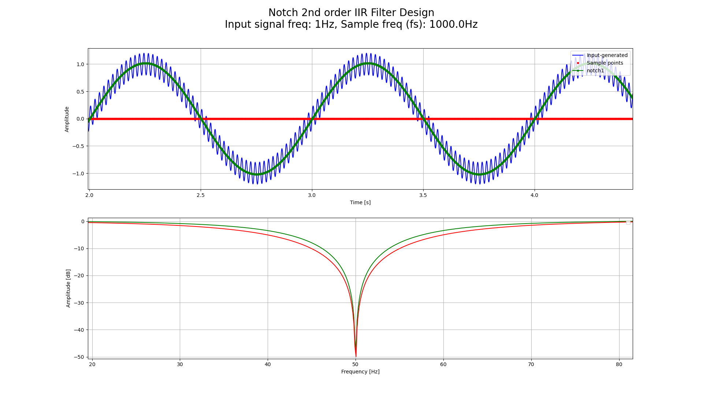

## Description

This repository contains simulations in Python using Matplotlib and C implementation tested on STM32 platfrom. All filters evaluated in simulations are realized in C for general embedded application use. 

RC/CR filter C implementation support also cascading filter but user shall notice that cascading two RC or CR filters does not have same characteristics as IIR 2nd order filter. To define 2nd order IIR filter beside cutoff frequency (fc) also damping factors ($\zeta$) must be defined.

For both FIR and IIR C implementation filters coefficients must be defined at initialization time and are subject to application needs. C functions are prepared only to intake filter coefficient and therefore user shall use externla tools to evaluate appropriate filter for application and to acquire it's coefficients. Although 2nd order LPF, HPF and notch filter coefficients can be obtain from ***iir_filter.py*** script under /simulation directory. Similar to IIR filter, FIR filter coefficient can be calcualted with ***fir_filter.py*** script, with none or small changes applied.

C code release of filters can be found by separete repository: [C filter repository](https://github.com/Misc-library-for-DSP/filter) 

## List of all filters
 - RC filter (IIR 1st order LPF)
 - CR filter (IIR 1st order HPF)
 - FIR
 - IIR

## Simulations

#### RC/CR filter simulations
Before using RC/CR filter in embedded system analysis can be done first to define order and cutoff frequency of specific acquired signal. This can be done via ***rc_filter.py*** script.

##### Script configurations
Before running the script some settings should be change. Those are:
 - Sample frequency of real platform
 - Ideal sample frequency
 - Time window for observation
 - Shape of test input signal
 - Amplitude/offset/phase of input signal
 - Cut-off frequency of LPF/HPF
 - Order of LPF/HPF

```python
## Sample frequency
#   Sample frequency of real system   
#
# Unit: Hz
SAMPLE_FREQ = 100.0

# Ideal sample frequency
#   As a reference to sample rate constrained embedded system
#
# Unit: Hz
IDEAL_SAMPLE_FREQ = 20000.0

## Time window
#
# Unit: second
TIME_WINDOW = 2.5

## Input signal shape
INPUT_SIGNAL_AMPLITUDE = 1.0
INPUT_SIGNAL_OFFSET = 0.0
INPUT_SIGNAL_PHASE = 0.0

## Mux input signal
INPUT_SIGNAL_SELECTION = SignalMux.MUX_CTRL_SINE

## Input signal frequency
#
# Unit: Hz
INPUT_SIGNAL_FREQ = 5

## LPF fc
#
# Unit: Hz
LPF_FC_1 = 5.0
LPF_FC_2 = 5.0
LPF_FC_3 = 5.0

## LPF order
LPF_ORDER_1 = 1
LPF_ORDER_2 = 2
LPF_ORDER_3 = 3

## HPF fc
#
# Unit: Hz
HPF_FC_1 = 0.1
HPF_FC_2 = 0.1
HPF_FC_3 = 0.1

## HPF order
HPF_ORDER_1 = 1
HPF_ORDER_2 = 2
HPF_ORDER_3 = 3
```

##### Simple invokation of script via cmd:
```python
>>>py rc_filter.py
```

##### Example


#### FIR filter simulations
Similar to RC/CR filter simulation FIR filter has a list of configurations to be change according to simulation needs. It can be found at a top of a FIR filter simulator sript ***fir_filter.py***.

Calling sript is identical as shown at a previous example.

This script gives an example of ***firwin*** function usage to calculate FIR filter. Furthermore script has ability to simulate filters using externaly calculated FIR coefficient. For example from T-filter webpage ([link](http://t-filter.engineerjs.com/)).

##### Example



##### C implementation tests
Two different FIR filters were designed and tested on embedded platform (STM32) with current implementation of filter. Result of embedded filter were compared with python implementation of filter in order to confirm correct validation of C implementation.

First filter was low-pass designed with 9 taps and second with 25 taps. Both filters was design using T-Filter online calculator. Here are results of C implemented of filter:

C implementation:


Python simulation:


Detailed description of filter used above:
```
********************************************************
 EVALUATION OF FIR FILTER
******************************************************** 
 
 Following coefficient were calcualted by online 
 calculator: http://t-filter.engineerjs.com/
 
================================================================
EXAMPLE 0:
================================================================
pic: fir_evaluation_on_real_data_0.png
coef:[  0.02341152899192398,
        0.06471122356467367,
        0.12060371719780817,
        0.16958710211144923,
        0.1891554348168665,
        0.16958710211144923,
        0.12060371719780817,
        0.06471122356467367,
        0.02341152899192398,
     ]
taps: 9

================================================================
EXAMPLE 1:
================================================================
pic: fir_evaluation_on_real_data_1.png
coef:[  -0.005392788920679466,
        -0.0029050919204011926,
        -0.001258909518015039,
        0.0031062514135009396,
        0.010866599224457303,
        0.02226527409028689,
        0.036982494521830354,
        0.05407161051837529,
        0.07200917783384833,
        0.0889018940568695,
        0.10277548127558198,
        0.11189425867893746,
        0.11507335279221934,
        0.11189425867893746,
        0.10277548127558198,
        0.0889018940568695,
        0.07200917783384833,
        0.05407161051837529,
        0.036982494521830354,
        0.02226527409028689,
        0.010866599224457303,
        0.0031062514135009396,
        -0.001258909518015039,
        -0.0029050919204011926,
        -0.005392788920679466
 ]
taps: 25

Execution time of filter update function on embedded platform (STM32H7): 70us @180MHz
```


#### IIR filter simulations
Invocation and configuration of script is identical to RC/CR and FIR simulations. All examples bellow are described in ***iir_filter.py***.

##### 2nd order LPF


##### C implementation tests

Following two examples shows IIR filters in action where online acceleration data is being filtered with low pass 2nd order IIR filter. In first example cutoff frequency was set to 1Hz and in second 10Hz with sample frequency of 50Hz. Accelerometer was placed on top of steward platform in order to make equivalent test by controling movement of accelerometer.

###### Example 0:

C implementation


Python simulation:


###### Example 1:

C implementation:


Python simulation:


Detailed description of filter used in example above:
```
********************************************************
 EVALUATION OF IIR FILTER
******************************************************** 
 
Coefficient were calculated by iir_filters.py
 
================================================================
EXAMPLE 0:
================================================================
pic: iir_evaluation_on_real_data_0.png
a: [ 1.0, -1.96521693, 0.96909995]
b: [0.00097075, 0.00194151, 0.00097075]
fc = 1.0 Hz
zeta = 0.25
exe. time: 22us @180MHz (STM32H7)


================================================================
EXAMPLE 1:
================================================================
pic: iir_evaluation_on_real_data_1.png
a = [1.0, -1.04377111, 0.27236453]
b = [0.05714836, 0.11429671, 0.05714836]
fc = 10.0 Hz
zeta = 1.0
exe. time: 22us @180MHz (STM32H7)
```

##### 2nd order HPF


##### 2nd order notch
Notch filter is specialy designed to filter AC freuqency of 50Hz. Base input signal is 1Hz with added AC noise.


##### C implementation tests
Single test was perform where 1Hz sine signal was added 10Hz noise signal. Notch filter in that test was 2nd order with fc=10Hz and r=0.95.

Python simulation:


C implementation:


```
********************************************************
 EVALUATION OF IIR NOTCH FILTER
******************************************************** 
 
Coefficient were calculated by iir_filters.py

================================================================
EXAMPLE 0:
================================================================

Coefficient of notch filters used in test:
notch_a: [1, -1.496681439593653, 0.8556250000000001]
notch_b: [1, -1.618033988749895, 1]
fnotch = 10Hz
r = 0.95
fs = 100Hz
exe. time: 22us @180MHz (STM32H7)
```

#### Reading signal from CSV file
Analysing raw signals store in CSV file can be done via ***filter_csv.py*** script. For help invoke with -h argument.

NOTE: For know only RC and CR filter can be used with thin script! Additional constrain for know is that sript only intake first row of CSV table. This will be fixed in future!

```python
>>>py filter_csv.py -h
usage: filter_csv.py [-h] -f FILE -fs SAMPLE_FREQ -fc CUTOFF_FREQ -fl FILTER -or ORDER

This script is for evaluation of filtering raw data from CSV file

optional arguments:
  -h, --help                                    show this help message and exit
  -f FILE, --file FILE                          file to analyze
  -fs SAMPLE_FREQ, --sample_freq SAMPLE_FREQ    sample time in Hz
  -fc CUTOFF_FREQ, --cutoff_freq CUTOFF_FREQ    cutoff freq in Hz
  -fl FILTER, --filter FILTER                   type of filter. Options: 'RC', 'CR'
  -or ORDER, --order ORDER                      order of filter

Enjoy the program!
```

In simulations signal is being shown in time and frequency domain. By inspecting frequency signature of raw signal cutoff frequency of selected filter can be easily determine. 

##### Example of accelerometer data filtering

```python
# Example of invocation from console
# Input file: steward_imu_roll_pitch_full_range_1_0Hz.csv
# Cutoff freq: 12.0 Hz
# Sample freq: 100.0 Hz
# Filter: RC
# Order: 3 (number of cascaded RC blocks)
>>>py filter_csv.py -f ..\..\test_data\steward_imu_roll_pitch_full_range_1_0Hz.csv -fc 12.0 -fs 100.0 -fl "RC" -or 3
```


This example shows signal acquire from accelerometer and RC low pass filter in work. Upper picture shows raw and filtered signals in time domain and bottom shows same signals in frequency domain.


## C implementation
### RC & CR filter (1st order IIR)
There are only two functions being a part of RC filter API:
 - *filter_status_t ***filter_rc_init***(p_filter_rc_t * p_filter_inst, const float32_t fc, const float32_t dt, const uint8_t order, const float32_t init_value)*
 - *float32_t ***filter_rc_update***(p_filter_rc_t p_filter_inst, const float32_t x)*
  - *filter_status_t ***filter_cr_init***(p_filter_cr_t * p_filter_inst, const float32_t fc, const float32_t dt, const uint8_t order, const float32_t init_value)*
 - *float32_t ***filter_cr_update***(p_filter_cr_t p_filter_inst, const float32_t x)*

 ##### Example of usage

```C
// 1. Declare filter instance
p_filter_rc_t my_filter_inst = NULL;

/* 
*   2. Init RC filter with following parameters:
*   - fc = 10Hz
*   - order = 1
*   - inititial value = 0
*/ 
if ( eFILTER_OK != filter_rc_init( &my_filter_instance, 10.0f, SAMPLE_TIME, 1, 0 ))
{
    // Filter init failed
    // Further actions here...
}

// 3. Apply filter in period of SAMPLE_TIME
loop @SAMPLE_TIME
{
    // Update filter
    filtered_signal = filter_rc_update( my_filter_inst, raw_signal );
}

```


### FIR filter
There are only two functions being a part of FIR filter API:
 - filter_status_t ***filter_fir_init***(p_filter_fir_t * p_filter_inst, const float32_t *p_a, const uint8_t order)
 - float32_t ***filter_fir_update***(p_filter_fir_t p_filter_inst, const float32_t x)


 ##### Example of usage
```C
// 1. Declare filter instance
p_filter_fir_t gp_filter_fir = NULL;

/* 2. Prepare FIR coefficients
* NOTE: Use fir_filter.py sript or external tool to get FIR coefficients.
*/
const float32_t gf_fir_coef[9] =
{   0.02341152899192398f,
    0.06471122356467367f,
    0.12060371719780817f,
    0.16958710211144923f,
    0.1891554348168665f,
    0.16958710211144923f,
    0.12060371719780817f,
    0.06471122356467367f,
    0.02341152899192398f
};

/* 
*   3. Init FIR filter with following parameters
*/ 
if ( eFILTER_OK != filter_fir_init( &gp_filter_fir, &gf_fir_coeff, 9 ))
{
    // Filter init failed
    // Further actions here...
}

// 3. Apply filter in period of SAMPLE_TIME
loop @SAMPLE_TIME
{
    // Update filter
    filtered_signal = filter_fir_update( gp_filter_fir, raw_signal );
}

```


### IIR filter
There are only two functions being a part of IIR filter API:
 - filter_status_t ***filter_iir_init***(p_filter_iir_t * p_filter_inst, const float32_t *p_a, const float32_t *p_b, const uint32_t a_size, const uint32_t b_size )
 - float32_t ***filter_iir_update***(p_filter_iir_t p_filter_inst, const float32_t x)


 ##### Example of usage
```C
// 1. Declare filter instance
p_filter_iir_t gp_filter_iir = NULL;

/* 2. Prepare IIR coefficients
* NOTE: Use iir_filter.py sript or external tool to get IIR coefficients.
*/
const float32_t gf_iir_a_coef[3] =
{
	1.0f,
	-1.04377111f,
	0.27236453f
};

const float32_t gf_iir_b_coef[3] =
{
	0.05714836f,
	0.11429671f,
	0.05714836f
};

/* 
*   3. Init IIR filter with following parameters
*/ 
if ( eFILTER_OK != filter_iir_init( &gp_filter_iir, &gf_iir_a_coef, &gf_iir_b_coef, 3, 3 ))
{
    // Filter init failed
    // Further actions here...
}

// 3. Apply filter in period of SAMPLE_TIME
loop @SAMPLE_TIME
{
    // Update filter
    filtered_signal = filter_iir_update( gp_filter_iir, raw_signal );
}
```


## TODO
 - [x] Evaluation of RC filter in python
 - [x] Evaluation of CR filter in python
 - [x] Implementation of RC filter in C   
 - [x] Implementation of CR filter in C   
 - [x] Evaluation of FIR filter in python   
 - [x] Evaluation of IIR filter (LPF, HPF, notch) in python   
 - [x] Make filter_csv.py configurable via argparse
 - [ ] Add row selection to filter_csv.py
 - [x] Implementation of FIR filter in C   
 - [x] Implementation of IIR filter in C   
 - [x] Evaluation of washout filter in python
 - [x] Implementation of washout filter in C


    
